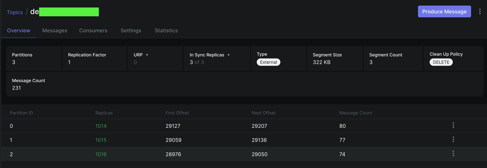
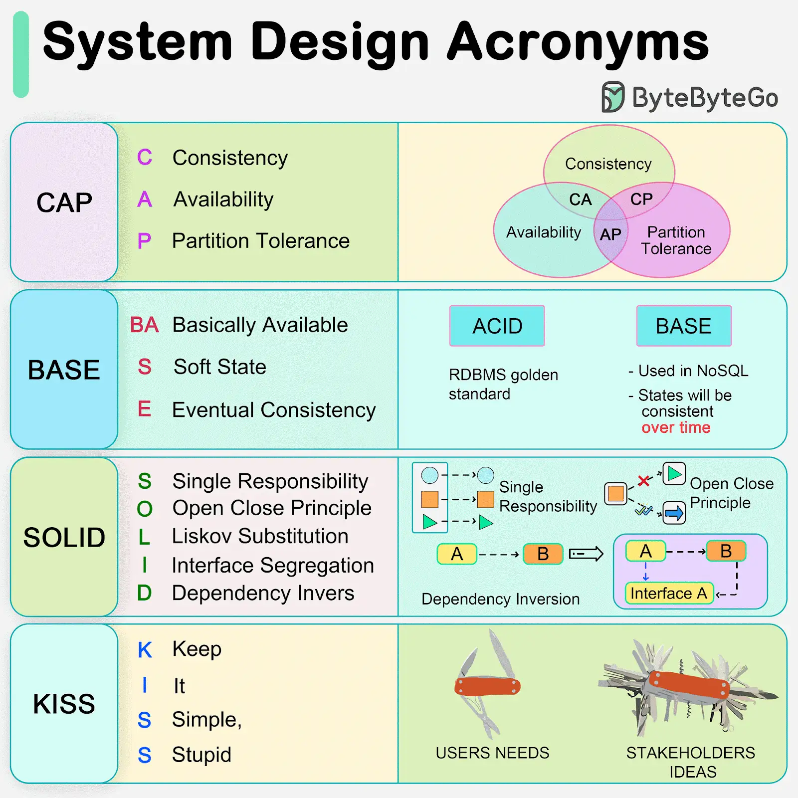

##
- 공부(깊이)
- 개발자 관점
- 운영자 관점

```markdown
Note that Kafka is positioned as an event streaming platform, 
so the term “message”, which is often used in message queues, is not used in Kafka. 
We call it an “event”.
```

## Key Takeaways

## 1장
- 카프카의 등장 배경
- 카프카에서 데이터의 기본 단위는 `메시지`다.
- 카프카의 입장에서 메시지는 단순히 `바이트의 배열`
- 메시지는 키(key)

그림 1-5(여러 개의 파티션을 갖는 토픽)


- 카프카는 `CAP` 관점에서 살펴볼 필요가 있음. 도메인의 특성에 따라 조금씩 개발 및 운영방식이 달라짐
- 추후 배울 개념


## 2장
- https://brunch.co.kr/@peter5236/13
- 파티션은 수는 늘리면 (절대) 다시 줄일 수가 없으니까, 항상 이 부분 을 명심하셔야한다. -> p.29 


## 3장
- https://www.yuki-dev-blog.site/data-engineering/kafka/kafka-core-guide/3
- 해당 내용으로 갈음하겠습니다.
- p.54 
# 
- 기술적으로 이야기 하면, 카프카 프로듀서는 언제나 비동기적으로 작동한다. / # .get() -> 비동기 -> 동기 
- 

카프카 프로듀서(3장)
- Kafka 3.0 이후 버전에서는 acks=all을 설정하면 enable.idempotence=true가 자동 활성화됩니다.
- https://cwiki.apache.org/confluence/display/KAFKA/KIP-679%3A+Producer+will+enable+the+strongest+delivery+guarantee+by+default
```java
        // For idempotence producers, values for `retries` and `acks` and `max.in.flight.requests.per.connection` need validation
        if (idempotenceEnabled) {
            final int retries = this.getInt(RETRIES_CONFIG);
            if (retries == 0) {
                if (userConfiguredIdempotence) {
                    throw new ConfigException("Must set " + RETRIES_CONFIG + " to non-zero when using the idempotent producer.");
                }
                log.info("Idempotence will be disabled because {} is set to 0.", RETRIES_CONFIG);
                shouldDisableIdempotence = true;
            }

            final short acks = Short.parseShort(acksStr);
            if (acks != (short) -1) {
                if (userConfiguredIdempotence) {
                    throw new ConfigException("Must set " + ACKS_CONFIG + " to all in order to use the idempotent " +
                        "producer. Otherwise we cannot guarantee idempotence.");
                }
                log.info("Idempotence will be disabled because {} is set to {}, not set to 'all'.", ACKS_CONFIG, acks);
                shouldDisableIdempotence = true;
            }

            final int inFlightConnection = this.getInt(MAX_IN_FLIGHT_REQUESTS_PER_CONNECTION);
            if (MAX_IN_FLIGHT_REQUESTS_PER_CONNECTION_FOR_IDEMPOTENCE < inFlightConnection) {
                throw new ConfigException("To use the idempotent producer, " + MAX_IN_FLIGHT_REQUESTS_PER_CONNECTION +
                                          " must be set to at most 5. Current value is " + inFlightConnection + ".");
            }
        }

```

```markdown
🔹 Kafka Producer에서 Idempotence(멱등성)을 사용하려면?
1) retries > 0 → 재시도 가능해야 함.
2) acks = all → 모든 복제본이 메시지를 받을 때까지 기다려야 함.
3) max.in.flight.requests.per.connection ≤ 5 → 순서가 꼬이지 않도록 제한해야 함.

만약 이 조건이 만족되지 않으면:

- 사용자가 idempotenceEnabled = true로 설정했으면 → 예외 발생 (ConfigException 던짐).
- 사용자가 idempotenceEnabled를 명시적으로 설정하지 않았다면 → 자동으로 멱등성을 비활성화 (shouldDisableIdempotence = true).

```


### 심화 자료
- https://blog.bytebytego.com/p/why-is-kafka-so-fast-how-does-it
- Kafka Producer 내부에서 RecordBatch가 ProducerBatch로 변경됨.
- Kafka 2.1.0 이후 버전에서는 RecordAccumulator가 Map<TopicPartition, Deque<ProducerBatch>>를 관리.

